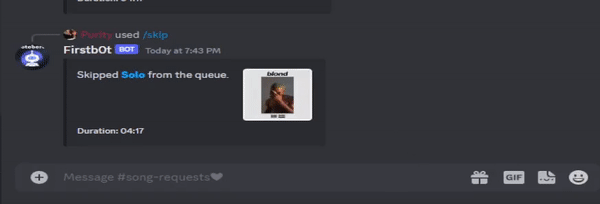

# discord-bot
Second **Pre-release** of the bot with _GPT3.5-turbo_ and _Music_ integration.

## Features
- :robot: The GPT3.5-turbo integration is in the form of a chat bot, similar to chat gpt. (Uses '>>' as prefix, might change that to a '/' command in the future, not sure)

- :musical_note: Music integration (slash command: '/play ...'):
    - Play
    - Pause/Play toggle
    - Queue
    - Skip
    - Stop
    
- :x: Still missing error catchers

- :crystal_ball: Future Plans:
    - Shuffle command
    - Removing specific track from queue command
    - Playing song at a specific timestamp
    - Music analysis and more integrations with last.fm api

## Preview
GPT 3.5 Turbo:  

Music commands screenshot:  

Joint playlist command: (Creates a playlist with the top tracks of each user)  

